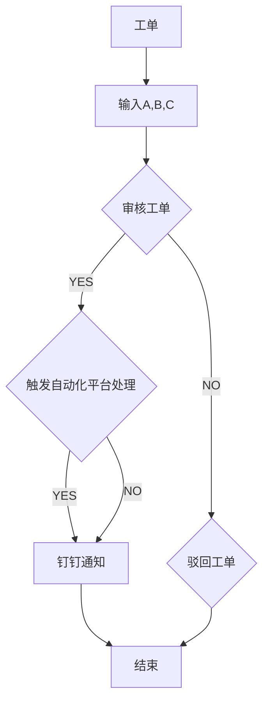
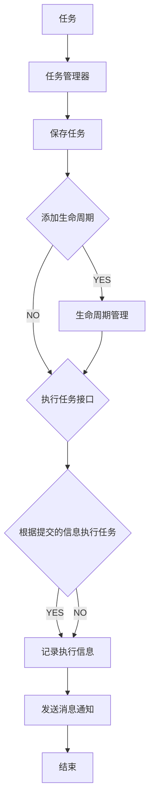

### 目的: 
减少运维对重复性，复杂度比较低的任务，通过钉钉工单的方式自动化处理

### 目前接入计划

- 新员工创建RAM用户
- jumpserver 账号创建
- 创建新AK，配置过期限期，并提醒
- VPN账号
- 新资产申请备案：使用人、用途，有效期
- gitlab权限申请
- 临时权限的申请期限提醒，临时权限开放最长为7天，7天后提醒清理权限

### 架构

```mermaid
graph BR

start[工单] --> input[输入A,B,C]
input --> conditionA{审核工单}
conditionA -- YES --> conditionC{触发自动化平台处理}
conditionA -- NO --> conditionB{驳回工单}

conditionC -- YES --> Send[钉钉通知]
conditionC -- NO --> Send[钉钉通知]


Send --> stop[结束]

conditionB --> stop

```

```mermaid
graph BR

start[任务] --> input[任务管理器]

input[任务管理器] --> save[保存任务]

save --> abc{添加生命周期}

abc -- YES --> efd[生命周期管理]

abc -- NO --> conditionA{执行任务接口}

efd[生命周期管理] --> conditionA{执行任务接口}

conditionA --> conditionB{根据提交的信息执行任务}

conditionB -- YES --> conditionC[记录执行信息]
conditionB -- NO --> conditionC[记录执行信息]

conditionC --> conditionD[发送消息通知]

conditionD --> stop[结束]

```

