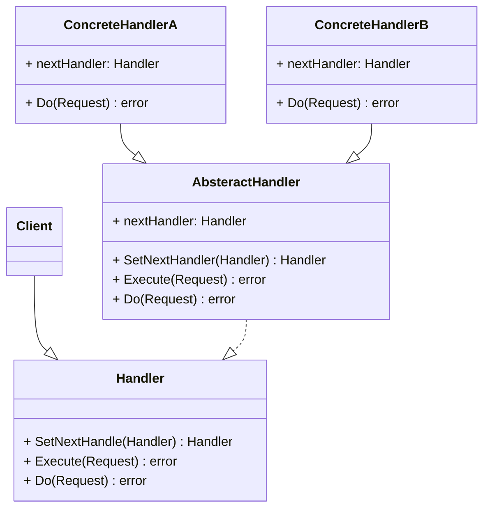

	
	
摘要: desc
<!-- more -->

## 责任链模式

责任链模式是一种行为设计模式，允许你将请求沿着处理者链进行发送，收到请求后，每个处理者可对请求进行处理，或将其传递给链上的下个处理者。
该模式允许多个对象来对请求进行处理，而无需让发送者类与具体接收者类相耦合。链可在运行时由遵循标准处理者接口的任意处理者动态生成。





### 接口和抽象类

由于 Go 并不支持继承，即使Next实现了Do方法，也不能达到在父类方法中调用子类方法的效果—即在我们的例子里面用Next 类型的Execute方法调用不到外部实现类型的Do方法。所以我们这里选择Next类型直接不实现Do方法，这也是在暗示这个类型是专门用作让实现类进行内嵌组合使用的。


```golang
type PatientHandler interface {
 Execute(*patient) error
 SetNext(PatientHandler) PatientHandler
 Do(*patient) error
}

// 充当抽象类型，实现公共方法，抽象方法不实现留给实现类自己实现
type Next struct {
 nextHandler PatientHandler
}

func (n *Next) SetNext(handler PatientHandler) PatientHandler {
 n.nextHandler = handler
 return handler
}

func (n *Next) Execute(patient *patient) (err error) {
 // 调用不到外部类型的 Do 方法，所以 Next 不能实现 Do 方法
 if n.nextHandler != nil {
  if err = n.nextHandler.Do(patient); err != nil {
   return
  }

  return n.nextHandler.Execute(patient)
 }

 return
}

```


### 职责链要处理的请求

```golang
//流程中的请求类--患者
type patient struct {
 Name              string
 RegistrationDone  bool
 DoctorCheckUpDone bool
 MedicineDone      bool
 PaymentDone       bool
}

// Reception 挂号处处理器
type Reception struct {
 Next
}

func (r *Reception) Do(p *patient) (err error) {
 if p.RegistrationDone {
  fmt.Println("Patient registration already done")
  return
 }
 fmt.Println("Reception registering patient")
 p.RegistrationDone = true
 return
}

// Clinic 诊室处理器--用于医生给病人看病
type Clinic struct {
 Next
}

func (d *Clinic) Do(p *patient) (err error) {
 if p.DoctorCheckUpDone {
  fmt.Println("Doctor checkup already done")
  return
 }
 fmt.Println("Doctor checking patient")
 p.DoctorCheckUpDone = true
 return
}

// Cashier 收费处处理器
type Cashier struct {
 Next
}

func (c *Cashier) Do(p *patient) (err error) {
 if p.PaymentDone {
  fmt.Println("Payment Done")
  return
 }
 fmt.Println("Cashier getting money from patient patient")
 p.PaymentDone = true
 return
}

// Pharmacy 药房处理器
type Pharmacy struct {
 Next
}


func (m *Pharmacy) Do (p *patient) (err error) {
 if p.MedicineDone {
  fmt.Println("Medicine already given to patient")
  return
 }
 fmt.Println("Pharmacy giving medicine to patient")
 p.MedicineDone = true
 return
}

// StartHandler 不做操作，作为第一个Handler向下转发请求
type StartHandler struct {
 Next
}

// Do 空Handler的Do
func (h *StartHandler) Do(c *patient) (err error) {
 // 空Handler 这里什么也不做 只是载体 do nothing...
 return
}


func main() {
 patientHealthHandler := StartHandler{}
 //
 patient := &patient{Name: "abc"}
 // 设置病人看病的链路
 patientHealthHandler.SetNext(&Reception{}).// 挂号
  SetNext(&Clinic{}). // 诊室看病
  SetNext(&Cashier{}). // 收费处交钱
  SetNext(&Pharmacy{}) // 药房拿药
 //还可以扩展，比如中间加入化验科化验，图像科拍片等等

 // 执行上面设置好的业务流程
 if err := patientHealthHandler.Execute(patient); err != nil {
  // 异常
  fmt.Println("Fail | Error:" + err.Error())
  return
 }
 // 成功
 fmt.Println("Success")
}

```


### 例子

1、 敏感词过滤(消息过滤器，权限拦截器)

```go
package main

import (
   "fmt"
   "strings"
)

type Handler interface {
   Handle(content string)
   next(handler Handler, content string)
}

// AdHandler 广告过滤
type AdHandler struct {
   handler Handler
}

func (ad *AdHandler) Handle(content string) {
   fmt.Println("执行广告过滤...")
   newContent := strings.Replace(content, "广告", "**", 1)
   fmt.Println(newContent)
}

func (ad *AdHandler) next(handler Handler, content string) {
   if ad.handler != nil {
      ad.handler.Handle(content)
   }
}

// YellowHandler 涉黄过滤
type YellowHandler struct {
   handler Handler
}

func (yellow *YellowHandler) Handle(content string) {
   fmt.Println("执行涉黄过滤...")
   newContent := strings.Replace(content, "涉黄", "**", 1)
   fmt.Println(newContent)
   yellow.next(yellow.handler, newContent)
}

func (yellow *YellowHandler) next(handler Handler, content string) {
   if yellow.handler != nil {
      yellow.handler.Handle(content)
   }
}

type SensitiveHandler struct {
   handler Handler
}

func (sensitive *SensitiveHandler) Handle(content string) {
   fmt.Println("执行敏感词过滤...")
   newContent := strings.Replace(content, "敏感词", "**", 1)
   fmt.Println(newContent)
   sensitive.next(sensitive.handler, newContent)
}

func (sensitive *SensitiveHandler) next(handler Handler, content string) {
   if sensitive.handler != nil {
      sensitive.handler.Handle(content)
   }
}

func main() {
   adHandler := &AdHandler{}
   yellowHandler := &YellowHandler{}
   sensitiveHandler := &SensitiveHandler{}
   // 将责任链串起来
   adHandler.handler = yellowHandler
   yellowHandler.handler = sensitiveHandler

   adHandler.Handle("我是正常内容，我是广告，我是涉黄，我是敏感词，我是正常内容")
}

```


2、登机流程

```go
package main

import "fmt"

// BoardingProcessor 登机过程中，各节点统一处理接口
type BoardingProcessor interface {
  SetNextProcessor(processor BoardingProcessor)
  ProcessFor(passenger *Passenger)
}

// Passenger 旅客
type Passenger struct {
  name                  string // 姓名
  hasBoardingPass       bool   // 是否办理登机牌
  hasLuggage            bool   // 是否有行李需要托运
  isPassIdentityCheck   bool   // 是否通过身份校验
  isPassSecurityCheck   bool   // 是否通过安检
  isCompleteForBoarding bool   // 是否完成登机
}

// baseBoardingProcessor 登机流程处理器基类
type baseBoardingProcessor struct {
  // nextProcessor 下一个登机处理流程
  nextProcessor BoardingProcessor
}

// SetNextProcessor 基类中统一实现设置下一个处理器方法
func (b *baseBoardingProcessor) SetNextProcessor(processor BoardingProcessor) {
  b.nextProcessor = processor
}

// ProcessFor 基类中统一实现下一个处理器流转
func (b *baseBoardingProcessor) ProcessFor(passenger *Passenger) {
  if b.nextProcessor != nil {
    b.nextProcessor.ProcessFor(passenger)
  }
}

// boardingPassProcessor 办理登机牌处理器
type boardingPassProcessor struct {
  baseBoardingProcessor // 引用基类
}

func (b *boardingPassProcessor) ProcessFor(passenger *Passenger) {
  if !passenger.hasBoardingPass {
    fmt.Printf("为旅客%s办理登机牌;\n", passenger.name)
    passenger.hasBoardingPass = true
  }
  // 成功办理登机牌后，进入下一个流程处理
  b.baseBoardingProcessor.ProcessFor(passenger)
}

// luggageCheckInProcessor 托运行李处理器
type luggageCheckInProcessor struct {
  baseBoardingProcessor
}

func (l *luggageCheckInProcessor) ProcessFor(passenger *Passenger) {
  if !passenger.hasBoardingPass {
    fmt.Printf("旅客%s未办理登机牌，不能托运行李;\n", passenger.name)
    return
  }
  if passenger.hasLuggage {
    fmt.Printf("为旅客%s办理行李托运;\n", passenger.name)
  }
  l.baseBoardingProcessor.ProcessFor(passenger)
}

// identityCheckProcessor 校验身份处理器
type identityCheckProcessor struct {
  baseBoardingProcessor
}

func (i *identityCheckProcessor) ProcessFor(passenger *Passenger) {
  if !passenger.hasBoardingPass {
    fmt.Printf("旅客%s未办理登机牌，不能办理身份校验;\n", passenger.name)
    return
  }
  if !passenger.isPassIdentityCheck {
    fmt.Printf("为旅客%s核实身份信息;\n", passenger.name)
    passenger.isPassIdentityCheck = true
  }
  i.baseBoardingProcessor.ProcessFor(passenger)
}

// securityCheckProcessor 安检处理器
type securityCheckProcessor struct {
  baseBoardingProcessor
}

func (s *securityCheckProcessor) ProcessFor(passenger *Passenger) {
  if !passenger.hasBoardingPass {
    fmt.Printf("旅客%s未办理登机牌，不能进行安检;\n", passenger.name)
    return
  }
  if !passenger.isPassSecurityCheck {
    fmt.Printf("为旅客%s进行安检;\n", passenger.name)
    passenger.isPassSecurityCheck = true
  }
  s.baseBoardingProcessor.ProcessFor(passenger)
}

// completeBoardingProcessor 完成登机处理器
type completeBoardingProcessor struct {
  baseBoardingProcessor
}

func (c *completeBoardingProcessor) ProcessFor(passenger *Passenger) {
  if !passenger.hasBoardingPass ||
    !passenger.isPassIdentityCheck ||
    !passenger.isPassSecurityCheck {
    fmt.Printf("旅客%s登机检查过程未完成，不能登机;\n", passenger.name)
    return
  }
  passenger.isCompleteForBoarding = true
  fmt.Printf("旅客%s成功登机;\n", passenger.name)
}


// BuildBoardingProcessorChain 构建登机流程处理链
func BuildBoardingProcessorChain() BoardingProcessor {
  completeBoardingNode := &completeBoardingProcessor{}

  securityCheckNode := &securityCheckProcessor{}
  securityCheckNode.SetNextProcessor(completeBoardingNode)

  identityCheckNode := &identityCheckProcessor{}
  identityCheckNode.SetNextProcessor(securityCheckNode)

  luggageCheckInNode := &luggageCheckInProcessor{}
  luggageCheckInNode.SetNextProcessor(identityCheckNode)

  boardingPassNode := &boardingPassProcessor{}
  boardingPassNode.SetNextProcessor(luggageCheckInNode)
  return boardingPassNode
}


func main() {  
   abc := &Passenger{  
      name:                  "李四",  
      hasBoardingPass:       false,  
      hasLuggage:            true,  
      isPassIdentityCheck:   false,  
      isPassSecurityCheck:   false,  
      isCompleteForBoarding: false,  
   }  
  
   boardingProcessor := BuildBoardingProcessorChain()  
   boardingProcessor.ProcessFor(abc)  
}
```