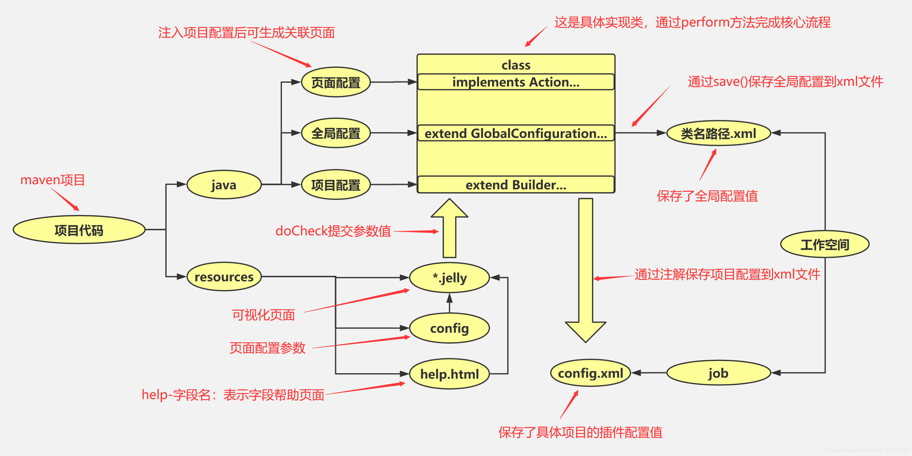

  
  
摘要: jenkins插件开发
<!-- more -->


## 环境准备
[简单示例](https://www.jenkins.io/zh/doc/developer/tutorial/prepare/)
[插件文档](https://www.jenkins.io/doc/developer/plugin-development/)
[开发wiki文档](https://wiki.jenkins-ci.org/display/JENKINS/Extend+Jenkins)

### jdk 和 maven 安装
<h1>略</h1>

### maven settings.xml 配置

vim settings.xml
```
<settings>

  <pluginGroups>
    <pluginGroup>org.jenkins-ci.tools</pluginGroup>
  </pluginGroups>
  <profiles>
    <!-- Give access to Jenkins plugins -->
    <profile>
      <id>jenkins</id>
      <activation>
        <activeByDefault>true</activeByDefault> <!-- change this to false, if you don't like to have it on per default -->
      </activation>
      <repositories>
        <repository>
          <id>repo.jenkins-ci.org</id>
          <url>https://repo.jenkins-ci.org/public/</url>
        </repository>
      </repositories>
      <pluginRepositories>
        <pluginRepository>
          <id>repo.jenkins-ci.org</id>
          <url>https://repo.jenkins-ci.org/public/</url>
        </pluginRepository>
      </pluginRepositories>
    </profile>
  </profiles>
  <mirrors>
    <mirror>
      <id>repo.jenkins-ci.org</id>
      <url>https://repo.jenkins-ci.org/public/</url>
      <mirrorOf>m.g.o-public</mirrorOf>
    </mirror>
  </mirrors>
</settings>
```


### 生成模板
```
mvn -U archetype:generate -Dfilter=io.jenkins.archetypes:
或者

mvn archetype:generate -Dfilter=io.jenkins.archetypes:plugin

```

### 生成模板报错处理
可以成功执行，但不能成功创建一个Jenkins插件项目，报错
```
[WARNING] No archetype found in remote catalog. Defaulting to internal catalog
[INFO] Your filter doesn't match any archetype, so try again with another value.
```

[方案](https://github.com/jenkinsci/archetypes)
以非交互方式创建
```
mvn archetype:generate -B -DarchetypeGroupId=io.jenkins.archetypes -DarchetypeArtifactId=hello-world-plugin -DhostOnJenkinsGitHub=true -DarchetypeVersion=1.7 -DartifactId=somefeature
```


jenkins提供给了我们五种模板:

- 空插件(Jenkins插件的框架)
- 全局配置插件(具有POM和全局配置示例的Jenkins插件的框架)
- 全局共享库
- hello-world-plugin(带有POM的Jenkins插件的骨架和一个示例构建步骤)
- 脚本管道
 
我们选择了第二种。然后就是输入ArtifactId 和创建Maven项目一样GroupId呢这里就不能设置了，再然后呢就是设置 version 指定插锁创建插件的版本，这里还是使用默认的，直接 Enter 就行，最后确认 信息输入 y 回车，最后就生成了一个基本的jenkins插件项目了！


## 本地运行项目
```
mvn hpi:run
```

显示 Jenkins is fully up and running ,则项目启动完毕。

通过链接：http://localhost:8080/jenkins  进入到本地项目中。

第一次执行 mvn hpi:run 时，需要从网上下载work文件夹搭建jenkins项目环境，所以比较慢

## 调试插件
设置环境变量
- linux
```
export MAVEN_OPTS="-Xdebug -Xrunjdwp:transport=dt_socket,server=y,address=8000,suspend=n"
mvn hpi:run
```

- windows
```
set MAVEN_OPTS="-Xdebug -Xrunjdwp:transport=dt_socket,server=y,address=8000,suspend=n"
mvn hpi:run
```

修改端口
```
mvn hpi:run -Djetty.port =8090
```

设置上下文路径
```
mvn hpi:run -Dhpi.prefix=/jenkins
```

打包发布
```
mvn package
```

配置远程监听

```
1 在IDEA右上方Edit Configurations...
2 创建Remote-Debug
  参数
  Debugger mode: Attach to remote JVM
  Transport: Socket 
  Host: localhost
  Port: 8000
3 应用启动后, 在右上方点击Debug 'Remote-Debug'
4 访问http://localhost:8080/jenkins/ 进入Debug模式。
```

通过 mvn hpi:run 启动项目，然后通过idea启动debug，显示连接上socket即可
```
显示socket连接上，则可通过断点进行调试

注意：
1.idea若叉掉了terminal的运行窗口，则在下一次调试前需要再次设置环境变量
2.eclipse也能进行调试，此处无教程
3.mac和linux设置环境变量的方式与windows不一致
```

## 项目体系

插件的内部处理过程。




详细描述：
```
整体分两块，一块存放代码，一块存放工作区。
代码分两块，一块为java代码，一块为资源文件。java代码处理主流程，资源文件做页面及参数传递
java代码里可以继承抽象类实现不同功能。比如继承build，同时配置对应的jelly文件，则可以在jenkins控制台的"Build"配置构建处理。
*.jelly文件形成操作界面。它的作用是将参数值传递到java对应类中。
*.jelly文件可以有多个命名，默认使用config.jelly作为java同路径下的操作界面，还能使用global.jelly做jenkins的全局配置界面。
config.jelly的字段传入java类中时，会根据字段名称做一次方法调用。比如传入的字段是“name”，则会调用类下被构建步骤所扩展的doCheckName()方法。
控制台保存的配置参数，由java类处理，保存在指定xml文件中。如果是全局配置，则保存在根工作区下的同路径类.xml中；如果是项目配置，保存在/job/项目名/config.xml 文件中。
```

### 插件目录结构
```
pom.xml  ：   Maven的构建配置文件
src/main/java   ：   Java源文件目录
src/main/resources  ：   插件Jelly/Grovy视图
src/main/webapps   ：   插件的静态资源如images和html文件
```