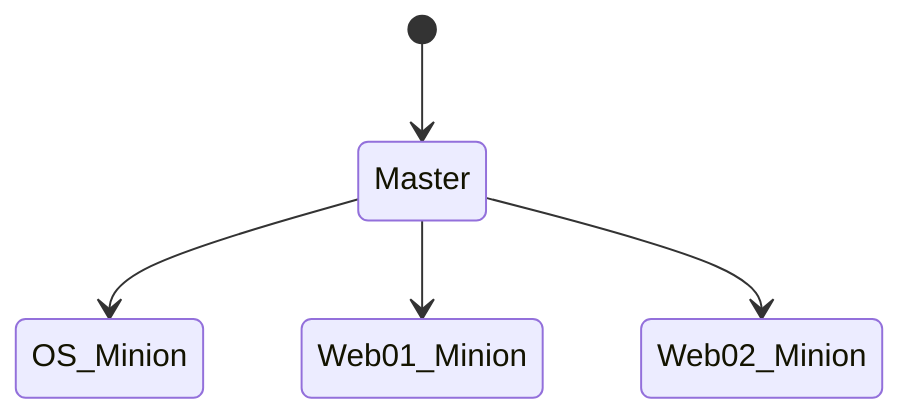

SaltStack 使用


### SaltStack 介绍

- SaltStack是一款Python开发的开源配置管理工具；
- 可用来发现、监控、响应、协调、自动化管理本地、混合、云和IOT资产;
- 其最主要的差异是主从模式，分为master和minions(slave)；
- 经过配置之后master可以管理成千上万个minions；
- master安装的是服务端组件salt-mater，minions安装的是salt-minion；
- Salt使用基于ZeroMQ的强大异步网络拓扑，主要是为实现最快的通信；
- Salt Master运行2个网络服务，ZeroMQ PUB系统，默认运行在4505端口；ZeroMQ REP系统，用于与Salt Minion进行双向通信，默认运行在4506端口；
- Salt客户端(salt命令)发送的命令将通过ZeroMQ PUB/SUB广播给各个Salt Minion。前提是Salt Minion配置了Mater，并且Salt Master通过salt-key命令信任了对应的Salt Minion。建立连接之后，Salt Minion可以接收到广播命令，并且执行；
- PUB/SUB是单向通信，因此一旦广播结束，Master服务器上的PUB接口就不会再与Minion进行任何通信。Minion在运行命令之后，通过REP端口(4506)将命令的返回数据发回Master。

#### 命令发布过程

SaltStack 的 Master 与 Minion 之间通过 ZeroMq 进行消息传递，使用 ZeroMq 的发布订阅模式，连接方式包括 TCP 和 IPC 。

Salt 命令，将 cmd.run ls  命令从 salt.client.LocalClient.cmd_cli 发布到 Master，获取一个 JobID ,根据 jobID 获取命令执行结果。

Master 接收到命令后，将要执行的命令发送给客户端 minion

Minion 从消息总线上接收到要处理的命令，交给 minion._handle_aes  处理。

Minion  minion._handle_aes   发起一个本地线程调用 cmdmod 执行 ls 命令。线程执行完 ls 后，调用 Minion._return_pub 方法。将执行结果通过消息总线返回给master。 

Master接收到客户端返回的结果，调用 master.handle_ase 方法将结果写到文件中。

Salt.client.LocalClient.cmd_cli 通过轮询获取Job 执行结果，将结果输出到终端。

#### salt部署基本架构





####  salt端口

安装好salt之后开始配置，salt-master默认监听两个端口：

```javascript
4505   publish_port   提供远程命令发送功能
4506   ret_port       提供认证，文件服务，结果收集等功能
确保客户端可以通信服务器的此2个端口，保证防火墙允许端口通过。因此在测试环境直接关闭防火墙。
```

#### 配置文件

```javascript
salt-master的配置文件是/etc/salt/master
salt-minion的配置文件是/etc/salt/minion
配置文件中包含了大量可调整的参数，这些参数控制master和minion各个方面
```

#### 配置 salt-master

```javascript
[root@master ~]# grep -v ^# /etc/salt/master|grep -v ^$
interface: 0.0.0.0  #绑定到本地的0.0.0.0地址

publish_port: 4505　　#管理端口，命令发送

user: root　　　　　　#运行salt进程的用户

worker_threads: 5　　#salt运行线程数，线程越多处理速度越快，不要超过cpu个数
 
ret_port: 4506　　#执行结果返回端口

pidfile: /var/run/salt-master.pid #pid文件位置

log_file: /var/log/salt/master　　#日志文件地址

#自动接收minion的key
auto_accept: False

# minion的识别ID，可以是IP，域名，或是可以通过DNS解析的字符串
id: slave   # 最好使用主机名

# salt运行的用户权限
user: root

# master的识别ID，可以是IP，域名，或是可以通过DNS解析的字符串
master : master    #master 地址
 
# master通信端口
master_port: 4506
 
# 备份模式，minion是本地备份，当进行文件管理时的文件备份模式
backup_mode: minion
 
# 执行salt-call时候的输出方式
output: nested
 
# minion等待master接受认证的时间
acceptance_wait_time: 10
 
# 失败重连次数，0表示无限次，非零会不断尝试到设置值后停止尝试
acceptance_wait_time_max: 0
 
# 重新认证延迟时间，可以避免因为master的key改变导致minion需要重新认证的syn风暴
random_reauth_delay: 60

# salt state执行时候的根目录
file_roots:
  base:
    - /srv/salt
```

####  配置satl-minion 

```javascript
[root@slave ~]# grep -v ^# /etc/salt/minion|grep -v ^$
master: master    #master 地址
master_port: 4506
user: root
id: slave   # 最好使用主机名
acceptance_wait_time: 10
log_file: /var/log/salt/minion
```


#### 启动salt-master和salt-minion

```javascript
systemctl start salt-minion
systemctl start salt-master

#检查salt状态
systemctl status salt-minion
systemctl status salt-master
```


### SaltStack VS Ansible


| SaltStack                                                    | Ansible                                       |
| ------------------------------------------------------------ | --------------------------------------------- |
| SaltStack 依靠ZeroMQ速度快                                   | Ansible SSH传输速度慢一些                     |
| ZeroMQ本身不加密，AES加密，需注意MITM攻击                    | SSH安全性高                                   |
| Master需要守护进程                                           | 无额外开支，SSH即可                           |
| State语法需要学习                                            | playbook语法相对简单，容易学习                |
| excution模块+state模块，state会调用excution模块              | Ansible模块+playbook                          |
| 使用topfile [top.sls](https://docs.saltstack.com/en/latest/ref/states/top.html) 使用[YAML](http://yaml.org/) | playbook使用YAML                              |
| 围绕Master输入命令，首次连接使用加密key，使用ZeroMQ库不会拥堵，持续连接速度更快 | 使用SSH通道，无固定Master，更安全，也有MQ版本 |
| 未提及                                                       | 配置记录文件，原始vs生产                      |
| 默认本地root，客户端root                                     | 支持多用户sudo操作                            |
| 密码容易保管，命令容易审计                                   | SSH，公钥连接                                 |
| 配置模块化，学习成本更高                                     | 克隆Ansible Git，语法简单                     |


### 安装

#### SALT MASTER

```
curl -L https://bootstrap.saltstack.com -o install_salt.sh
sudo sh install_salt.sh -P -M
```

#### SALT MINION

```
curl -L https://bootstrap.saltstack.com -o install_salt.sh
sudo sh install_salt.sh -P
```

配置脚本

```
#!/bin/bash

HostName=`hostname`
cp /etc/salt/minion /etc/salt/minion_bak
sed -i  "17a master: 172.16.102.33" /etc/salt/minion
sed -i  "113a id: $HostName" /etc/salt/minion

systemctl enable salt-minion
systemctl start salt-minion
```


### 在master上接收minion秘钥

在minion启动后连接master会请求master为其签发证书，等待证书签发完成后，master可以信任minion，并且minion和master之间的通信是加密的。

在salt-master执行

salt-key命令用于管理mionion秘钥

```javascript
[root@master ~]# salt-key -L
Accepted Keys:
Denied Keys:
Unaccepted Keys:
slave　　　　#此时已经出现slave
Rejected Keys:
```
此时slave已经出现在unaccepted keys中，说明minion已经和master联系，并且master已经获取了minion的公钥，等待下一步指令。

### 检查master和minion的秘钥匹配

在master上执行

```javascript
[root@master ~]# salt-key -f slave
Unaccepted Keys:
slave:  0a:b9:97:b5:9a:65:b8:49:a1:50:a5:6a:66:ce:33:ea
```

然后可以在minion上获取minion的秘钥

```javascript
[root@slave ~]# salt-call --local key.finger
local:
    0a:b9:97:b5:9a:65:b8:49:a1:50:a5:6a:66:ce:33:ea
```

因此可确认秘钥匹配，在master上接收秘钥

```javascript
[root@master ~]# salt-key -a slave
The following keys are going to be accepted:
Unaccepted Keys:
slave
Proceed? [n/Y] y
Key for minion slave accepted.
```

确认接收秘钥后，检验minion秘钥是否被接收

```javascript
[root@master ~]# salt-key -L
Accepted Keys:
slave
Denied Keys:
Unaccepted Keys:
Rejected Keys:
```

秘钥接收完成后，就可以执行第一条salt啦


### 认证命令介绍

```
salt-key –L #查看所有minion-key
salt-key –a #接受某个minion-key
salt-key –A #接受所有minion-key
salt-key –d #删除某个minion-key
salt-key –D #删除所有minion-key
```


### SaltStack minion 匹配方式

1、Glob（salt默认的target 类型，使用shell的通配符来指定一个或多个 minion ID）

```
salt \* test.ping  或者 salt '*' test.ping
```

2、 pcre 兼容正则表达式

```
salt -E ‘^[m|M]in.[e|o|u]n$’ test.ping
```

3、 subnet (通过指定一个IPv4 地址或一个CIDR 的IPv4 子网)

```
salt -S 192168.0.42 test.ping
或者
salt -s 192.168.0.0/16 test.ping
```

4、Grains（salt 可以通过操作系统、CPU架构及自定义信息等机器特征进行 target Minion）

```
salt -G 'os:Ubuntu' test.ping
salt -G 'os_family:Debian' test.ping
```

5、pillar (salt 支持通过 pillar 数据进行匹配)

```
salt -l 'my_val:my_val' test.ping
```

6、混合（compound）

```
salt -C 'web* or G@os:Arch' test.ping
```

### salt 常用模板


```
salt '*' status.loadavg            #系统信息
salt '*' status.cpuinfo            #CPU 信息
salt "*" status.diskstats          #查看磁盘信息
salt "*" status.meminfo            #查看内存信息
salt "*" status.w                  #w命令返回信息
salt node01  sys.list_modules      #查看所有module 列表 
salt node01  sys.list_functions cmd    查看指定 module 的所有function 方法
salt node01 sys.doc cmd.run        查看指定 module 用法

```


### salt相关命令

```

salt-run manage.up 			# 查看存活的minion
salt-run manage.down 		# 查看死掉的minion
salt-run manage.down removekeys=True 		# 查看down掉的minion，并将其删除
salt-run manage.status 					# 查看minion的相关状态
salt-run manage.versions 				# 查看salt的所有master和minion的版本信息
salt-run jobs.active 					# 查看哪些系统任务还在处理中
salt-run jobs.list_jobs 				# 显示所有的已完成或部分完成的任务信息
salt '*' saltutil.running 				# 查看运行的jobs ID
salt \* saltutil.kill_job 20151209034239907625 # kill掉进程ID
salt -d 					# 查看帮助文档
salt -d|grep service 				# 查看service相关模块命令
salt '*' sys.doc 				# 查看帮助文档
salt-key -L 				# 查询所有接收到的证书
salt-key -a <证书名> 				# 接收单个证书
salt-key -A 					# 接受所有证书
salt-key -d <证书名> 				# 删除单个证书
salt-key -D 						# 删除所有证书
salt '*' service.get_all 			# 获取主机所有服务
salt '*' service.reload sshd 		# 重载sshd服务
salt '*' pkg.list_pkgs # 显示软件包版本列表
salt '*' pkg.version python # 显示软件包版本信息
salt '*' pkg.install httpd # 安装软件包
salt 'node1.com' service.status mysql # 查看mysql服务状态
salt 'node1.com' service.start mysql # 启动mysql服务
salt 'node1.com' cmd.run 'service mysql status' # 与上面一样查看服务
salt '*' sys.list_modules # 模块列表
salt-cp '*' /etc/hosts /etc/hosts # 把master上的hosts文件分发到所有主机
salt '*' cp.get_file salt://ceshi/b /tmp/test # 把salt-master端相应的文件，分发文件到minion端
salt '*' cp.get_dir salt://zabbix /tmp # 把salt-master端相应的目录，分发文件到minion端
salt '*' file.copy /tmp/zabbix.sls /tmp/sls # 把salt-master端对应文件拷贝到minion端相应目录下
salt '*' cmd.run 'uptime' # 远程命令执行测试


```

 远程执行脚本

```
'cmd.script:'
 salt '*' cmd.script salt://scripts/runme.sh
 salt '*' cmd.script salt://scripts/runme.sh 'arg1 arg2 "arg 3"'
 salt '*' cmd.script salt://scripts/windows_task.ps1 args=' -Input c:\tmp\infile.txt' shell='powershell'
 salt '*' cmd.script salt://scripts/runme.sh stdin='one\ntwo\nthree\nfour\nfive\n'
 
 
'cmd.shell:'

 This passes the cmd argument directly to the shell
 salt '*' cmd.shell "ls -l | awk '/foo/{print \$2}'"
 salt '*' cmd.shell template=jinja "ls -l /tmp/{{grains.id}} | awk '/foo/{print \$2}'"
 salt '*' cmd.shell "Get-ChildItem C:\ " shell='powershell'
 salt '*' cmd.shell "grep f" stdin='one\ntwo\nthree\nfour\nfive\n'
 salt '*' cmd.shell cmd='sed -e s/=/:/g'
 
'cmd.shells:'
 salt '*' cmd.shells
'cmd.tty:'
 salt '*' cmd.tty tty0 'This is a test'
 salt '*' cmd.tty pts3 'This is a test'
 
'cmd.which:'
 salt '*' cmd.which cat
 
**grains选项：**
salt '*' grains.ls # 查看grains分类
salt '*' grains.items # 查看grains所有信息
salt '*' grains.item osrelease # 查看grains某个信息
```


