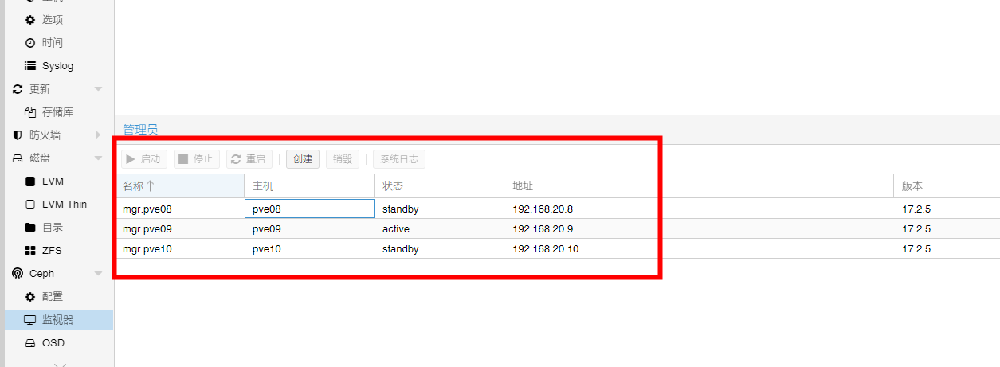
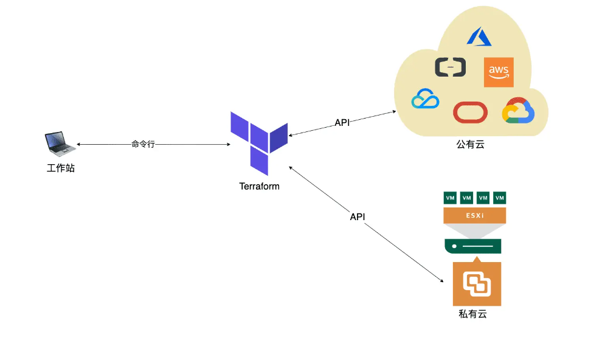

[TOC]

## 关于Proxmox

Proxmox VE 全称：Proxmox Virtual Environment，通常简称为PVE、Proxmox，是一个开源的服务器虚拟化环境Linux发行版。Proxmox VE基于Debian，使用基于Ubuntu的定制内核，包含安装程序、网页控制台和命令行工具，并且向第三方工具提供了REST API，在Affero通用公共许可证第三版下发行。

Proxmox VE是Linux开发者Dietmar和Martin Maurer为了解决OpenVZ不提供备份工具及管理界面而开发的软件。KVM支持则在后续被加入。首个版本的Proxmox VE发布于2008年4月。

## 集群规划


|主机名 | 管理ip | Ceph ip | 域 | 端口聚合|
|---|---|---|---|---|
|pve01.ztyc.zt | 10.200.77.1 |192.168.10.1| ztyc.zt| eno1,eno2聚合为vmbr0 eno3,eno4聚合为vmbr1|
|pve02.ztyc.zt| 10.200.77.2 |192.168.10.2 |ztyc.zt |eno1,eno2聚合为vmbr0  eno3,eno4聚合为vmbr1|
|pve03.ztyc.zt |10.200.77.3 |192.168.10.3| ztyc.zt |eno1,eno2聚合为vmbr0  eno3,eno4聚合为vmbr1|
|pve04.ztyc.zt |10.200.77.4 |192.168.10.4| ztyc.zt |eno1,eno2聚合为vmbr0  eno3,eno4聚合为vmbr1|
|pve05.ztyc.zt |10.200.77.5| 192.168.10.5| ztyc.zt | eno1,eno2聚合为vmbr0  eno3,eno4聚合为vmbr1|

<hr/>

## 安装PVE

### pve 镜像下载

到Proxmox官网 <https://www.proxmox.com> 下载最新版的PVE系统ISO 镜像

```txt
https://www.proxmox.com/en/downloads/category/iso-images-pve
```

### U盘启动

使用rufus工具将iso镜像文件写入U盘，

### 系统安装


同意协议，选择"I agree"


输入服务器的国家china、选择区域和键盘布局


设置root登陆密码和邮箱


确认无误，点击install 开始安装


安装完成，点击reboot 重启

安装完成之后通过 界面上面提示的管理地址访问，用户名为 root 密码为前面配置的root密码

## 优化

### 配置软件源

修改软件源之前，做好备份

| 名称 | source文件路径 ||
|---|---|---|
|debain | /etc/apt/sources.list||
| pve | /etc/apt/sources.list.d/pve-no-subscription.list | | 
| ceph | /etc/apt/sources.list.d/ceph.list | 这个文件默认没有，需要自行创建|

操作命令

```bash
#关掉官方源
echo "#deb https://enterprise.proxmox.com/debian/pve bullseye pve-enterprise" > /etc/apt/sources.list.d/pve-enterprise.list

wget https://mirrors.ustc.edu.cn/proxmox/debian/proxmox-release-bullseye.gpg -O /etc/apt/trusted.gpg.d/proxmox-release-bullseye.gpg

# 中科大源
echo "deb https://mirrors.ustc.edu.cn/proxmox/debian/pve bullseye pve-no-subscription" > /etc/apt/sources.list.d/pve-no-subscription.list

#中科大源
echo "deb https://mirrors.ustc.edu.cn/proxmox/debian/ceph-pacific bullseye main" > /etc/apt/sources.list.d/ceph.list

#中科大源
sed -i.bak "s#http://download.proxmox.com/debian#https://mirrors.ustc.edu.cn/proxmox/debian#g" /usr/share/perl5/PVE/CLI/pveceph.pm

#清华Debian源
sed -i.bak "s#ftp.debian.org/debian#mirrors.tuna.tsinghua.edu.cn/debian#g" /etc/apt/sources.list

#清华Debian源
sed -i "s#security.debian.org#mirrors.tuna.tsinghua.edu.cn/debian-security#g" /etc/apt/sources.list

#LXC容器源
cp /usr/share/perl5/PVE/APLInfo.pm /usr/share/perl5/PVE/APLInfo.pm_back
sed -i 's|http://download.proxmox.com|https://mirrors.tuna.tsinghua.edu.cn/proxmox|g' /usr/share/perl5/PVE/APLInfo.pm

#更新软件列表
apt update && apt dist-upgrade

systemctl restart pvedaemon.service

#更新PVE至最新版本（按需）
apt upgrade
```

### 安装软件

安装ifupdown2 ，此组件用于配置网卡后重启网卡操作

```bash
apt install ifupdown2 vim -y

#安装时间同步工具，自动同步时间 
apt install chrony -y
```

### 配置ntp

配置统一的时钟源
如果有条件建议在内网部署一台ntp服务器，所有节点与内网ntp同步时钟。
如果没有内网NTP服务器，可以采用下列NTP服务器。

|机构|URL|
|---|---|
|阿里云|ntp.aliyun.com|
|国家授时中心|ntp.ntsc.ac.cn|

修改

```bash
# PVE7.x 默认没有带timesyncd，需要自行安装
vi /etc/systemd/timesyncd.conf

# 将NTP取消注释，填写ntp服务器地址
[Time]
NTP=ntp.aliyun.com

# 配置完成后重启时间服务
systemctl restart systemd-timesyncd

# chrony 配置
vim /etc/chrony/chrony.conf

# 将默认的上游服务地址注释
# Use Debian vendor zone.
# pool 2.debian.pool.ntp.org iburst
server ntp.aliyun.com iburst


# 配置完成后重启时间服务
systemctl restart chronyd

# 开机启动
systemctl enable chronyd
```

### 关闭订阅提示

```bash
echo "修改去除订阅弹窗"

sed -i.backup -z "s/res === null || res === undefined || \!res || res\n\t\t\t.data.status.toLowerCase() \!== 'active'/false/g" /usr/share/javascript/proxmox-widget-toolkit/proxmoxlib.js

systemctl restart pveproxy

```

### 显示CPU频率(按需优化,未验证)

```bash
#!/usr/bin/env bash
np="/usr/share/perl5/PVE/API2/Nodes.pm"
pvejs="/usr/share/pve-manager/js/pvemanagerlib.js"
plib="/usr/share/javascript/proxmox-widget-toolkit/proxmoxlib.js"


pvever=$(pveversion | awk -F"/" '{print $2}')
echo "pve版本$pvever"
echo "备份源文件"
[ ! -e $np.$pvever.bak ] && cp $np $np.$pvever.bak || { echo "已经修改过，请务重复执行"; exit 1;}
[ ! -e $pvejs.$pvever.bak ] && cp $pvejs $pvejs.$pvever.bak
[ ! -e $plib.$pvever.bak ] && cp $plib $plib.$pvever.bak
 
therm='$res->{thermalstate} = `sensors`;';
cpure='$res->{cpure} = `cat /proc/cpuinfo | grep -i "cpu mhz"`;';

echo "修改node.pm"
sed -i "/PVE::pvecfg::version_text()/a $cpuren$therm" $np

sed -n "/PVE::pvecfg::version_text()/,+5p" $np


tmpf=tmpfile.temp
touch $tmpf
cat > $tmpf << 'EOF'
{
itemId: 'thermal',
colspan: 2,
printBar: false,
title: gettext('温度'),
textField: 'thermalstate',
renderer:function(value){
const m = value.match(/(?<=:[^+]++)d+/g)
return `CPU: ${m[0]}(${m[1]},${m[2]},${m[3]},${m[4]}) | BOARD: ${m[5]} | NVME: ${m[6]}`;
}
},
{
itemId: 'cpumhz',
colspan: 2,
printBar: false,
title: gettext('CPU频率'),
textField: 'cpure',
renderer:function(value){
const m = value.match(/(?<=:s+)(d+)/g);
return `CPUMHZ: ${m[0]} | ${m[1]} | ${m[2]} | ${m[3]}`;
}
},
EOF


#找到关键字pveversion的行号
echo "修改pvemanagerlib.js"
ln=$(sed -n '/pveversion/,+10{/},/{=;q}}' $pvejs)
echo "匹配的行号pveversion: " $ln
 
echo "修改结果: "
sed -i "${ln}r $tmpf" $pvejs
sed -n '/pveversion/,+30p' $pvejs

rm $tmpf


echo "修改页面高度"
sed -i -r '/widget.pveNodeStatus/,+5{/height/{s#[0-9]+#360#}}' $pvejs
sed -n '/widget.pveNodeStatus/,+5{/height/{p}}' $pvejs
sed -i -r '/[logView]/,+5{/heigh/{s#[0-9]+#460#;}}' $pvejs
sed -n '/[logView]/,+5{/heigh/{p}}' $pvejs


systemctl restart pveproxy

```

### 降低ZFS内存使用率(按需优化,未验证)

```bash
#降低ZFS内存使用率
echo "$[10 * 1024*1024*1024]" >/sys/module/zfs/parameters/zfs_arc_max
 
cat > /lib/systemd/system/rc-local.service <<EOF
[Unit]
Description=/etc/rc.local
ConditionPathExists=/etc/rc.local
 
[Service]
Type=forking
ExecStart=/etc/rc.local start
TimeoutSec=0
StandardOutput=tty
RemainAfterExit=yes
SysVStartPriority=99
 
[Install]
WantedBy=multi-user.target
EOF
 
cat > /etc/rc.local <<EOF
#!/bin/sh -e
#
# rc.local
#
# This script is executed at the end of each multiuser runlevel.
# Make sure that the script will "exit 0" on success or any other
# value on error.
#
# In order to enable or disable this script just change the execution
# bits.
#
# By default this script does nothing.

bash /root/MemoryDown.sh
EOF
 
chmod +x /etc/rc.local
 
cat > /root/MemoryDown.sh <<EOF
echo "$[10 * 1024*1024*1024]" >/sys/module/zfs/parameters/zfs_arc_max
EOF
 
systemctl start rc-local
```

### UI增加CPU温度显示(按需优化,未验证)

```bash
#!/usr/bin/env bash
np="/usr/share/perl5/PVE/API2/Nodes.pm"
pvejs="/usr/share/pve-manager/js/pvemanagerlib.js"
plib="/usr/share/javascript/proxmox-widget-toolkit/proxmoxlib.js"
 
 
pvever=$(pveversion | awk -F"/" '{print $2}')
echo pve版本$pvever
echo 备份源文件
[ ! -e $np.$pvever.bak ] && cp $np $np.$pvever.bak || { echo 已经修改过，请务重复执行; exit 1;}
[ ! -e $pvejs.$pvever.bak ] && cp $pvejs $pvejs.$pvever.bak
[ ! -e $plib.$pvever.bak ] && cp $plib $plib.$pvever.bak
 
therm='$res->{thermalstate} = `sensors`;';
cpure='$res->{cpure} = `cat /proc/cpuinfo | grep -i "cpu mhz"`;';
 
echo 修改node.pm：
sed -i "/PVE::pvecfg::version_text()/a $cpuren$therm" $np
 
sed -n "/PVE::pvecfg::version_text()/,+5p" $np
 
 
tmpf=tmpfile.temp
touch $tmpf
cat > $tmpf << 'EOF'
{
itemId: 'thermal',
colspan: 2,
printBar: false,
title: gettext('温度'),
textField: 'thermalstate',
renderer:function(value){
const m = value.match(/(?<=:[^+]++)d+/g)
return `CPU: ${m[0]}(${m[1]},${m[2]},${m[3]},${m[4]}) | BOARD: ${m[5]} | NVME: ${m[6]}`;
}
},
{
itemId: 'cpumhz',
colspan: 2,
printBar: false,
title: gettext('CPU频率'),
textField: 'cpure',
renderer:function(value){
const m = value.match(/(?<=:s+)(d+)/g);
return `CPUMHZ: ${m[0]} | ${m[1]} | ${m[2]} | ${m[3]}`;
}
},
EOF
 
#找到关键字pveversion的行号
echo 修改pvemanagerlib.js
ln=$(sed -n '/pveversion/,+10{/},/{=;q}}' $pvejs)
echo "匹配的行号pveversion：" $ln
 
echo 修改结果：
sed -i "${ln}r $tmpf" $pvejs
sed -n '/pveversion/,+30p' $pvejs
 
rm $tmpf
 
 
echo 修改页面高度
sed -i -r '/widget.pveNodeStatus/,+5{/height/{s#[0-9]+#360#}}' $pvejs
sed -n '/widget.pveNodeStatus/,+5{/height/{p}}' $pvejs
sed -i -r '/[logView]/,+5{/heigh/{s#[0-9]+#460#;}}' $pvejs
sed -n '/[logView]/,+5{/heigh/{p}}' $pvejs
 
 
systemctl restart pveproxy
```

### 降低SWAP权重(按需优化,未验证)

```bash
sysctl vm.swappiness=0
grep "swappiness" /etc/sysctl.conf >> /dev/null 2>&1 ||cat >> /etc/sysctl.conf <<EOF
vm.swappiness=0
EOF
```

### img磁盘转换(按需优化,未验证)

```bash
read -p "请输入虚拟机ID: " vm_id
read -p "请输入要转换的镜像名称(包括后缀名): " vm_img_name
qm importdisk $vm_id $vm_img_name local-lvm
```

## Openvswith

PVE 网络配置

在一个高配置的Proxmox VE 超融合集群中，为充分利用资源，需要按某种需求将虚拟机之间进行网络隔离，以支持更大规模的场景。

生产环境对可靠性要求较高，所以建议采用链路聚合方式，将多个物理网卡绑定为一个逻辑接口，从而提高网络的性能及可靠性。
链路聚合可在以下三种模式中选择

- LACP（802.3ad）：基于LACP协议的链路聚合，此模式交换机需配置链路聚合，模式为lacp。
- 静态聚合：静态链路聚合，此模式交换机需配置链路聚合，模式为静态（华为、H3C默认为此模式；思科为on模式）。
- Active+Backup：主备模式，网卡一主一备，主网卡故障时备份网卡接替主网卡工作，此模式交换机无需做链路聚合配置。

若交换机支持LACP，推荐采用LACP模式。


### 安装openvswitch

集群的每一个节点，都要进行安装，安装的步骤很简单，仅需输入命令"apt install openvswitch-switch"即可。

```bash
apt install openvswitch-switch -y
```

端口聚合配置,根据情况调整

```bash
# 备份interfaces 文件
cp /etc/network/interfaces /opt/

cat > /etc/network/interfaces <EOF
# Loopback interface
auto lo
iface lo inet loopback

# Bond eno1 and eno2 together
auto eno1
iface eno1 inet manual
  ovs_mtu 9000

auto eno2
iface eno2 inet manual
  ovs_mtu 9000


# Bond eno3 and eno4 together
auto eno3
iface eno3 inet manual
  ovs_mtu 9000

auto eno4
iface eno4 inet manual
  ovs_mtu 9000

auto bond0
iface bond0 inet manual
  # 端口聚合
  ovs_bridge vmbr0
  ovs_type OVSBond
  ovs_bonds eno1 eno2
  ovs_options bond_mode=balance-tcp lacp=active other_config:lacp-time=fast
  ovs_mtu 9000
  pre-up ( ip link set mtu 9000 dev eno1 && ip link set mtu 9000 dev eno2 )

auto bond1
iface bond1 inet manual
  # 端口聚合
  ovs_bridge vmbr1
  ovs_type OVSBond
  ovs_bonds eno3 eno4
  ovs_options bond_mode=balance-tcp lacp=active other_config:lacp-time=fast
  ovs_mtu 9000
  pre-up ( ip link set mtu 9000 dev eno3 && ip link set mtu 9000 dev eno4 )

# Bridge for our bond and vlan virtual interfaces (our VMs will
# also attach to this bridge)
auto vmbr0
iface vmbr0 inet manual
  # 端口绑定
  ovs_type OVSBridge
  ovs_ports bond0 vlan83 vlan84 vlan91 vlan92
  ovs_mtu 9000


# Bridge for our bond and vlan virtual interfaces (our VMs will
# also attach to this bridge)
auto vmbr1
iface vmbr1 inet manual
  # 端口绑定
  ovs_type OVSBridge
  ovs_ports bond1
  ovs_mtu 9000


# Proxmox cluster communication vlan
auto vlan92
iface vlan92 inet static
  ## 集群网络
  ovs_type OVSIntPort
  ovs_bridge vmbr0
  ovs_options tag=92
  address 10.200.92.77
  netmask 255.255.252.0
  gateway 10.200.92.1
  ovs_mtu 1500

# Ceph cluster communication vlan
auto vlan1920
iface vlan1920 inet static
  # Ceph 网络
  ovs_type OVSIntPort
  ovs_bridge vmbr1
  ovs_options tag=1920
  address 192.168.20.8/24
  gateway 192.168.20.1
  ovs_mtu 1500


EOF

# 重启网络
systemctl restart networking
```

使用openvswith网络后，创建的虚拟机（vm），需要添加网络标签（vlan id）

## 组建集群

### 加入node

加入集群的节点一定要确保存储数量一致！！！，否则会拖死集群


搭建集群，选择集群网络


复制加入信息，在node节点使用


**注意:** 添加node之后如果导致整个集群卡，访问慢，可能是corosync 服务同步配置到新node时卡住
需要在所有node节点上重启 corosync 服务

```bash
systemctl restart corosync.service
```

### 集群删除节点

在待隔离节点上停止 pve-cluster 服务

```bash
systemctl stop pve-cluster.service
systemctl stop corosync.service
```

将待隔离节点的集群文件系统设置为本地模式

```bash
pmxcfs -l
```

```bash
rm /etc/pve/corosync.conf
rm -rf /etc/corosync/*
```

重新启动集群文件系统服务

```bash
killall pmxcfs
systemctl start pve-cluster.service
```

删除故障节点node文件,在还正常的集群某节点执行即可

```bash
pvecm delnode NodeName
```

清理集群残留信息：

```bash
cd /etc/pve/nodes
ls
rm -rf /etc/pve/nodes/pve02    #改成故障节点对应路径
```

#### 故障节点离线（小毛病，需要委外维修)

在需要离线的节点操作

```bash
systemctl stop pve-cluster.service
systemctl stop corosync.service
pmxcfs -l
rm /etc/pve/corosync.conf
rm -rf /etc/corosync/*
killall pmxcfs
systemctl start pve-cluster.service
cd /etc/pve/nodes
ls
rm -rf /etc/pve/nodes/pve10
pvecm delnode pve10

```

在正常的节点操作：

```bash
cd /etc/pve/nodes

rm -rf pve10

pvecm delnode pve10

```

修好回来，再重新加入集群即可


## Ceph

Ceph以其先进的去中心化设计，成为了分布式块存储领域的佼佼者，它可以将多台服务器中的硬盘聚合成一个集群，对外可提供文件存储、块存储、对象存储等多种形式，Ceph的另一个特点是数据采用多副本方式存储，避免由于单点故障造成的业务中断和数据丢失。

### Ceph的注意事项

Proxmox VE提供了简单易用的Ceph 安装向导，选中集群中的一个节点，然后在菜单树中打开Ceph菜单区，就可以开始安装Ceph 了。

安装向导有多个步骤，每个步骤都需要执行成功才可以完成Ceph 安装。开始安装操作后，向导会自动从Proxmox VE 的Ceph 软件源下载软件包并完成安装。

完成第一个步骤后，还需要创建配置。对每个集群，生成的配置信息会自动分发到其他节点，所以该操作只需要执行一次即可。

创建的配置包括以下信息：

1.Public Network

为避免影响集群通信等其他对网络延迟敏感的服务，也为了提高Ceph 性能，强烈建议为Ceph 准备一个专门的独立网络，将Ceph流量隔离开来。

2.Cluster Network

进一步，还可以设置Cluster Network，将OSD复制和心跳流量隔离出来。这将有效降低public network的负载，并有效改善大规模Ceph集群的性能。

### 初始化Ceph安装和配置

每个节点都需要安装Ceph，每个节点的Ceph安装基本相同

在节点1界面中，选择“Ceph→Install Ceph”，点击“Install Ceph”按钮


输入"Y"之后，按回车键，自动安装Ceph


ceph 配置


ceph 安装完成


### 配置Ceph监视器

Ceph安装完成之后，节点1出现"监视器"和"管理员"中，如果没有出现节点2和节点3的监视器，还需要把节点2和节点3添加进来。



### 配置Ceph的OSD

选择 "Ceph→OSD→创建:OSD"，在磁盘中，逐次添加 sdb、sdc、没有被使用的磁盘，数据库磁盘和WAL磁盘保持默认即可


### 配置CephFS

略

### 配置Pools资源池

选择 "Ceph→Pools→创建"，点击"创建"按钮，创建名称为 "hdd_storage" 的存储


根据官方的文档，pg_num这个数值比较关键，如果不合适的话，Ceph会告警，官方建议:

```txt
若少于5个OSD， 设置pg_num为128
5~10个OSD，设置pg_num为512
10~50个OSD，设置pg_num为4096
```

### Ceph磁盘管理

#### OSD磁盘下线

如果想要把一个Ceph的OSD磁盘更换下来，先选中OSD磁盘，接着按"停止" 按钮先停止OSD服务，接着再按"Out"按钮，这个时候就可以把该磁盘取出。

#### OSD磁盘上线

OSD磁盘加载与OSD磁盘卸载过程刚好相反，先把磁盘插进服务器的盘位中，接着先按"in"按钮，等"in"图标变为绿色之后，再按"启动"按钮启动OSD服务，过几秒钟之后，OSD便会恢复正常

### Pools 性能测试

#### 创建 测试的pool

```bash
# 创建 pool
ceph osd pool create test 64 64

# 查看size
ceph osd pool get test size

# 查看pg_num
ceph osd pool get test pg_num

# 查看默认配置
ceph osd dump | grep test

# 查看资源占用
rados -p test df

```

- 测试写性能

如果加上可选参数 --no-cleanup ，那么测试完之后，不会删除该池里面的数据。里面的数据可以继续用于测试集群的读性能。

```bash
rados bench -p test 60 write --no-cleanup

......

Total time run:         60.4201
Total writes made:      1620
Write size:             4194304
Object size:            4194304
Bandwidth (MB/sec):     107.249
Stddev Bandwidth:       10.6689
Max bandwidth (MB/sec): 124
Min bandwidth (MB/sec): 72
Average IOPS:           26
Stddev IOPS:            2.66723
Max IOPS:               31
Min IOPS:               18
Average Latency(s):     0.59499
Stddev Latency(s):      0.280176
Max latency(s):         2.03348
Min latency(s):         0.123926
```

测试数据可以看出：数据写入时的平均带宽是107MB/sec，最大带宽是124MB/sec，带宽标准差是17（反应网络稳定情况）

- 读性能测试

```bash
rados bench -p test 60 rand

......

Total time run:       60.5273
Total reads made:     2615
Read size:            4194304
Object size:          4194304
Bandwidth (MB/sec):   172.815
Average IOPS:         43
Stddev IOPS:          4.19641
Max IOPS:             53
Min IOPS:             35
Average Latency(s):   0.368047
Max latency(s):       1.35368
Min latency(s):       0.00414599

```

数据读取时的平均带宽是172MB/sec，平均延时是0.3 sec，平均IOPS是43

#### 测试数据清除

```bash
rados -p test cleanup
```

#### 删除test池

```bash
ceph osd pool delete test test --yes-i-really-really-mean-it
```

## PVE集群节点宕机处理

登录集群任意物理正常节点系统，查看ceph osd状态,在还正常的集群某节点执行即可

```bash
ceph osd tree
```

登陆 ceph monitor 节点，查询 ceph 状态

```bash
ceph health detail
```

将故障节点上的所有 osd 设置成 out，该步骤会触发数据 recovery, 需要等待数据迁移完成, 同时观察虚拟机是否正常

```bash
ceph osd out osd_id
```

从 crushmap 将 osd 移除，该步骤会触发数据 reblance，等待数据迁移完成，同时观察虚拟机是否正常

```bash
ceph osd crush remove osd_name
```

删除 osd 的认证

```bash
ceph auth del osd_name
```

删除 osd

```bash
ceph osd rm osd_id
```

从ceph集群中删除物理节点，操作如下

```bash
ceph osd crush rm  pve004
```

移除监视器器

```bash
ceph mon remove pve004
```

从集群中删除故障节点

```bash
pvecm  delnode pve004

cd /etc/pve/nodes

rm -rf pve004

```

## HA功能

### 创建HA群组

选择 "HA->群组->创建"


### 创建参与HA的对象

HA->资源->添加参与ha的容器或者虚拟机(虚拟机一定要是存储在cephrbd盘里面的才行)


## Cloud-init 模板

Cloud-init 是一个 Linux 虚拟机的初始化工具，被广泛应用在阿里云、华为云、AWS、OpenStack等主流云平台中，用于快速新建虚拟机，并进行一些系统初始化的任务，包括NTP、软件源、主机名、IP、磁盘和SSH密钥等。

### Cloud Images 是什么镜像

1.使用对象：Cloud Images 是面向公有云用户，也即是AWS/Azure/GCP/阿里云/腾讯云这种云服务器上，能够二次定制、批量部署，适用于虚拟机环境。

2.文件格式：Cloud Images 就是一个虚拟磁盘镜像，通常为 raw/vmdk/qcow2/img，不同于一般发行版为 iso 格式。

3.功能：和 Server 版本无大的区别，但是 Cloud Images 精简了 Server 版本无用的软件包，体积更小，性能消耗更小。

4.使用: Cloud Images 不同于其他版本使用 ISO 安装，Cloud Images 是直接将磁盘镜像文件挂载到虚拟机上。通过 Cloud-init 组件，自动下发 root 账号密码，不需要手动创建账号，开机就用，能够快速部署，完美适用于虚拟环境。

### 获取 Cloud Images

Cloud Images 镜像已经内置了 Cloud-Init 组件，我们无需再手动安装。下面是一些常用的 Linux 发行版 Cloud Images 镜像下载地址

|版本|URL|
|---|---|
|CentOS| <https://cloud.centos.org/centos/>|
|Ubuntu| <https://cloud-images.ubuntu.com/releases/>|
|Debian| <https://cloud.debian.org/images/cloud/>|
|Fedoa| <https://alt.fedoraproject.org/cloud/>|
|RedHat| <https://access.redhat.com/downloads/>|
|OpenSUSE| <http://download.opensuse.org/repositories/Cloud:/Images:/>|

### 使用cloud image 创建虚拟机

```bash
# 下载cloud images 到 /var/lib/vz/images

cd /var/lib/vz/images
wget https://cloud.centos.org/centos/7/images/CentOS-7-x86_64-GenericCloud-2211.qcow2c
```


不使用任何介质


勾选qemu


删除硬盘接口，不需要任何硬盘
后面会导入cloud image


CPU 内存，根据需要调整即可


桥接选择，规划后的端口聚合端口


确认后，点击完成

### 修改虚拟机硬件

删除硬盘，cdron,添加 cloud-init 设备，串行设备


### 导入cloud镜像

```bash
qm importdisk 1000 /var/lib/vz/images/CentOS-7-x86_64-GenericCloud-1907.qcow2 local-lvm --format=qcow2


1000 指的是刚刚创建的那台机器id

--format=qcow2 表示以qcow2格式导入，如果镜像后缀本来就是qcow2后缀就没必要用这个选项
```

添加之后，硬件面板会有一块未使用磁盘，双击后点击添加


### 调整磁盘

导入的磁盘一般比较小，根据需要调整到合适的大小


### 调整引导顺序

创建VM时，没有添加磁盘，默认就会从网卡启动，磁盘添加后需要调整到磁盘优先启动


### 配置cloud-init信息


配置完成之后就可以启动虚拟机了

### 使用pm 命令创建虚拟机

```bash
qm create 9002 --name "centos-10-cloudinit-template" --memory 2048 --net0 virtio,bridge=vmbr0  --onboot 1 --agent 1
qm importdisk 9002 centos-image.qcow2 hdd_storage
qm set 9002 --scsihw virtio-scsi-pci --scsi0 hdd_storage:vm-9002-disk-0
qm set 9002 --ide2 hdd_storage:cloudinit
qm set 9002 --boot c --bootdisk scsi0
qm set 9002 --serial0 socket --vga serial0
qm set 9002 --ipconfig0 ip=10.200.92.79/22,gw=10.200.92.1
qm set 9002 --ciuser=root
qm set 9002 --cipassword=ztyc1234

#  配置ssh key
#qm set 9002 --sshkeys=$SSHKEY

# 将虚拟机转换为模板
qm template $vmid

# 调整磁盘大小
qm resize $vmid scsi0 +18228M
```

## Terraform 创建VM

官方文档

```txt
https://registry.terraform.io/providers/Telmate/proxmox/latest/docs#creating-the-proxmox-user-and-role-for-terraform
```



### 创建 Proxmox 用户及 API Token

使用 Proxmox VE 的 REST API 需要权限校验，有用户名密码或者 API Token 两种方式。我们选用后者，登陆到 Proxmox 宿主机，执行如下命令创建角色、用户以及 API Token

```bash
pveum role add TerraformProv -privs "VM.Allocate VM.Clone VM.Config.CDROM VM.Config.CPU VM.Config.Cloudinit VM.Config.Disk VM.Config.HWType VM.Config.Memory VM.Config.Network VM.Config.Options VM.Monitor VM.Audit VM.PowerMgmt Datastore.AllocateSpace Datastore.Audit"

pveum user add terraform-prov@pve
pveum aclmod / -user terraform-prov@pve -role TerraformProv
pveum user token add terraform-prov@pve terraform-token --privsep=0
```

### 创建一个常规的VM

第一次需要先执行 init 命令进行初始化

```bash
mkdir ubuntu
cd ubuntu

terraform init

# 可以使用 terraform fmt 和 terraform validate 对配置文件进行格式化和校验。
```

ubuntu 配置文件

```bash

vi ubuntu.tf


terraform {
  required_providers {
    proxmox = {
      source = "telmate/proxmox"
    }
  }
}

// 配置 provider
provider "proxmox" {
  pm_tls_insecure     = true
  # nuc.home替换成你的pve的地址，后面的:8006/api2/json保留
  pm_api_url          = "https://nuc.home:8006/api2/json"
  pm_api_token_id     = "terraform-prov@pve!terraform-token"
  pm_api_token_secret = "[上面创建pveum时的token]"
}

// 配置虚拟机资源
resource "proxmox_vm_qemu" "proxmox-ubuntu" {
  count = 1
  vmid = "${count.index + 400 + 1}"
  name  = "ubuntu-${count.index + 1}"
  desc  = "Ubuntu develop environment from Template[9100] create by terraform"

  # 节点名
  target_node = "nuc"

  # cloud-init template
  clone = "ubuntu22-cloud-init-tmpl"

  # 关机 guest agent
  agent   = 0
  os_type = "ubuntu"
  onboot  = true
  # CPU
  cores   = 2
  sockets = 1
  cpu     = "host"
  # 内存
  memory   = 4096
  scsihw   = "virtio-scsi-pci"
  bootdisk = "scsi0"

  # 硬盘设置
  disk {
    slot     = 0
    size     = "4096M"
    type     = "scsi"
    storage  = "local-lvm"
    iothread = 1
  }

  # 网络
  network {
    model  = "virtio"
    bridge = "vmbr0"
  }

  lifecycle {
    ignore_changes = [
      network,
    ]
  }
  # 记住这里要使用IP CIDR
  # 因为只创建一个虚拟机，虚拟机的 IP 是 192.168.50.91。如果要创建多个虚拟机的话，IP 将会是 .91、.92、.93 。
  ipconfig0 = "ip=192.168.50.9${count.index + 1}/24,gw=192.168.50.252"

  # 用户名和 SSH key
  ciuser  = "kevin"
  sshkeys = <<EOF
  [你的SSH KEY]
  EOF
}
```

然后执行 terraform apply 并输入 yes 开始创建虚拟机

```bash
terraform apply
```

销毁虚拟机

```bash
#虚拟机的销毁也很简单，执行 terraform destory 并输入 yes 即可
terraform destory
```

## Terraform基于cloud-init创建VM

### 创建目录

```bash
mkdir ubuntu

cd ubuntu 
terraform init
```

ubuntu 配置文件

```bash
vim ubuntu.tf 

terraform {
  required_providers {
    proxmox = {
      source = "telmate/proxmox"
    }
      macaddress = {
      source = "ivoronin/macaddress"
      version = "0.3.0"
    }
  }
}

// 配置 provider
provider "proxmox" {
  pm_tls_insecure     = true
  pm_api_url          = "https://nuc.home:8006/api2/json"
  pm_api_token_id     = "terraform-prov@pve!terraform-token"
  pm_api_token_secret = "[你的token]"
}

variable "vm_count" {
  type = number
  default = 1
}

variable "vm_id" {
  type = number
  default = 402
}

// 基于模版定义如何生成user-data 
data "template_file" "user_data" {
    count    = 1
    template = file("${path.module}/cloud-init/user-data.tmpl")
    vars     = {
      pubkey   = file(pathexpand("${path.module}/cloud-init/home_id_ed25519.pub"))
      hostname = "vm-${count.index}"
      passwd = "你的password，也可以不用，只用ssh key登录"
    }
}

// 真实渲染生成user-data放在本地
resource "local_file" "cloud_init_user_data_file" {
    count    = 1
    content  = data.template_file.user_data[count.index].rendered
    filename = "${path.module}/files/user_data_${count.index}.cfg"
}

// 生成network配置
data "template_file" "network_config" {
    count    = var.vm_count
    template = file("${path.module}/cloud-init/network-config.tmpl")
    vars     = {
      ip = "192.168.50.${count.index + 31}"
      macaddr = lower(macaddress.vm_mac_address.address)
    }
}

resource "local_file" "cloud_init_network_config_file" {
  count    = var.vm_count
  content  = data.template_file.network_config[count.index].rendered
  filename = "${path.module}/files/network-config_${count.index}.cfg"
}

resource "macaddress" "vm_mac_address" {
}

resource "null_resource" "cloud_init_config_files" {
  count = 1
  connection {
    type = "ssh"
    user     = "root"
    password = "[你的PVE机器密码]"
    host     = "192.168.50.225"
  }

  # 上传user-data
  provisioner "file" {
    source      = local_file.cloud_init_user_data_file[count.index].filename
    destination = "/var/lib/vz/snippets/user_data_vm-${count.index}.yml"
  }

  # 上传network config
  provisioner "file" {
    source      = local_file.cloud_init_network_config_file[count.index].filename
    destination = "/var/lib/vz/snippets/network-config_vm-${count.index}.yml"
  }
}


// 配置虚拟机资源
resource "proxmox_vm_qemu" "proxmox-ubuntu" {
  depends_on = [
    null_resource.cloud_init_config_files,
  ]
  count = 1
  vmid = var.vm_id
  name  = "ubuntu-${count.index + 1}"
  desc  = "Ubuntu develop environment from Template[u22] create by terraform"

  # 节点名
  target_node = "nuc"

  # cloud-init template
  #clone = "ubuntu22-cloud-init-tmpl"
  # 特别注意1/2： 这里必须选择一个没有带cloud-init磁盘的一个模版，不然会有两个cloud-init设备挂载会冲突
  clone = "u22"

  # 关机 guest agent
  agent   = 0
  # 这里要用cloud-init
  os_type = "cloud-init"
  onboot  = true
  # CPU
  cores   = 2
  sockets = 1
  cpu     = "host"
  # 内存
  memory   = 4096
  scsihw   = "virtio-scsi-pci"
  bootdisk = "scsi0"

  # 硬盘设置
  disk {
    slot     = 0
    size     = "4096M"
    type     = "scsi"
    storage  = "local-lvm"
    iothread = 1
  }

  # 网络
  network {
    model  = "virtio"
    bridge = "vmbr0"
    # 特别注意2/2： 这里要显式指定macaddr。如果不写，那样会随机生成的mac地址，但是我们cloud-init需要mac地址才能有静态IP，所以这里引用了一个外部生成mac地址的库。
    macaddr = lower(macaddress.vm_mac_address.address)
  }

  lifecycle {
    ignore_changes = [
      network,
    ]
  }

  cicustom = "user=local:snippets/user_data_vm-${count.index}.yml,network=local:snippets/network-config_vm-${count.index}.yml"
  cloudinit_cdrom_storage = "local-lvm"
}
```

- 显式指定了虚拟机磁盘空间，这对Terraform来说很简单。
- 通过Terraform的模版渲染了cloud-init所需要的两个文件user-data和network-config，并且将两个文件上传到PVE机器上。这一切都是自动化进行的。
- 通过telmate/proxmox的cicustom参数指定了我们上传的配置。这一步我们不必再手动手成cloud-init镜像了。

通过这种方式来使用cloud-init，切记你clone的虚拟机模版不能是已经包含cloud-init的，不然会有 lvcreate相关错误，所以你可以重新生成一个VM模版镜像。

创建模板脚本

```bash
TMPID=9200
TMPNAME=u22-tmpl
qm create ${TMPID} --name ${TMPNAME} --memory 2048 --net0 virtio,bridge=vmbr0

# 这里导入你的支持cloud-init的系统镜像，还是参考官方这篇文章

# <https://pve.proxmox.com/wiki/Cloud-Init_Support>

qm importdisk ${TMPID} jammy-server-cloudimg-amd64.img local-lvm
qm set ${TMPID} --scsihw virtio-scsi-pci --scsi0 local-lvm:vm-${TMPID}-disk-0

# 注释这一行

# qm set ${TMPID} --ide2 local-lvm:cloudinit
qm set ${TMPID} --boot c --bootdisk scsi0
qm set ${TMPID} --serial0 socket --vga serial0
qm set ${TMPID} --agent enabled=1

qm template ${TMPID}

```

user-date配置

```yaml
#cloud-config
hostname: ${hostname}
manage_etc_hosts: true
user: kevin
password: ${passwd}
ssh_authorized_keys:
  -  ${pubkey}
chpasswd:
  expire: False
users:
  - default
package_upgrade: true
```

network-config配置

```yaml
#cloud-config
version: 1
config:
    - type: physical
      name: eth0
      mac_address: "${macaddr}"
      subnets:
      - type: static
        address: '${ip}'
        netmask: '255.255.255.0'
        gateway: '192.168.50.252'
    - type: nameserver
      address:
      - '192.168.50.233'
      - '192.168.50.252'
      search:
      - '.'
```

Terraform部署

```bash
terraform apply
```

## 监控

### prometheus-pve-exporter

prometheus-pve-exporter 调用Proxmox的API采集指标，然后Prometheus再从 prometheus-pve-exporter 抓取metrics数据，最后通过Grafana展示。

prometheus-pve-exporter 依赖于 Proxmox 的用户授权，而这里的用户需要到 Proxmox 后台，DataCenter -> user 标签下查看

prometheus-pve-exporter的配置可以使用配置文件，也可以使用环境变量。我这里传入了 PVE_USER/PVE_PASSWORD/PVE_VERIFY_SSL，用来调用Proxmox API时进行认证。由于是监控请求，因此建议在Proxmox上新建一个只读的用户，不要使用root。Proxmox新建用户很简单，在页面上操作即可，但给用户授权只能通过命令行进行。

如下，给用户 monitor@pve授予PVEAuditor权限。

```bash
pveum aclmod / -user monitor@pve -role PVEAuditor
```

注意，PVE_USER的格式是user@pve或者user@pam，两者的区别是，pve是proxmox的用户，比如我这里是2台Proxmox组成的集群，建立一个pve用户就可以访问2台Proxmox机器；pam是linux的用户，不同的Proxmox机器的用户名密码可能不同（Proxmox实际也是一台Linux机器）。

PVE_VERIFY_SSL需要设置为false，因为是自签的证书。

prometheus-pve-exporter 可以直接启动，也可以容器化启动。

```bash
docker run --name prometheus-pve-exporter -d -p 127.0.0.1:9221:9221 -v /path/to/pve.yml:/etc/pve.yml prompve/prometheus-pve-exporter
```

### systemctl

config

```bash
vi /etc/prometheus/pve.yml

default:
  user: user@pve
  password: your_password_here
  verify_ssl: false
```

```bash
sudo tee /etc/systemd/system/prometheus-pve-exporter.service<<EOF
[Unit]
Description=Prometheus exporter for Proxmox VE
Documentation=https://github.com/znerol/prometheus-pve-exporter

[Service]
Restart=always
User=prometheus
ExecStart=/usr/local/bin/pve_exporter /etc/prometheus/pve.yml

[Install]
WantedBy=multi-user.target
EOF
```

```bash
systemctl daemon-reload
systemctl start prometheus-pve-exporter
systemctl enable prometheus-pve-exporter
```

### prometheus 正常采集

正常采集

### Grafana

Proxmox数据收集到Prometheus后，就可以通过Grafana展示了。这里我使用的是Proxmox via Prometheus by Pietro Saccardi。

```html
https://grafana.com/grafana/dashboards/10347-proxmox-via-prometheus/
```

## 网络测速

### 安装测速工具

```bash
# 网卡流量查看工具
apt install nload -y  

# 测速工具
apt install iperf3
```

### iperf3启动服务端

```bash
iperf3 -s -D -p 79

# 启动iperf3服务端
# iperf3 –s –u  # 3.1.7版本已经不需要-u参数,-s默认启动的tcp和udp
# -s 以服务器模式启动
# -D 以守护进程模式运行
# iperf3 -s -D

#服务端使用自定义端口
# -s 以服务器模式启动
# -p    定义端口号；
# -D 以守护进程模式运行
# iperf3 –s –p 55 -D

```

### 监听服务端网卡流量

```bash
nload -m enp2s0f0 enp2s0f1
```

### iperf3客户端

|客户端命令参数|参数描述|
|---|---|
|-c | 指定服务器地址|
|-p | 表示服务器的端口号|
|-u | 使用udp协议|
|-b | 指定客户端通过UDP协议发送信息的带宽，默认值为1Mbit/s|
|-n | 指定传输的字节数|
|-t |指定Iperf测试时间，默认10秒|
|-i |设置每次报告之间的时间间隔，单位为秒，如果设置为非零值，就会按照此时间间隔输出测试报告，默认值为零|
|-F |传输或接收特定的文件|
|-P |客户端到服务器的连接数，默认值为1|
|-T |指定ttl值|
|-w |设置套接字缓冲区为指定大小，对于TCP方式，此设置为TCP窗口大小，对于UDP方式，此设置为接受UDP数据包的缓冲区大小，限制可以接受数据包的最大值|
|–logfile|参数可以将输出的测试结果储存至文件中|
|-J |来输出JSON格式测试结果|
|-R |反向传输(测试下载速度)|

#### 上传速度

```bash
# 默认是测试的上传速度
## -c    表示服务器的IP地址；
iperf3 -c 测速服务器IP


# (-P)多线程
## -P 线程数
iperf3 -c 47.108.52.5 -t 60 -P 2 

#客户端UDP测速(上传) 
#UDP测速默认只有1M,需要准确测速需要加-b参数指定最大带宽
## -c  表示服务器的IP地址；
## -u  使用udp协议;
## -b  指定客户端通过UDP协议发送信息的带宽，默认值为1Mbit/s
## -t  持续时间60s
iperf3 –c 171.220.227.80 -u -b 1000M -t 60

```

#### 下载测速

```bash
# 测试下载测速
## -R 下载
iperf3 -c 47.108.52.5 -R

#客户端UDP测速(下载-R)
## -u  使用udp协议;
## -b  指定客户端通过UDP协议发送信息的带宽，默认值为1Mbit/s
## -R 下载
iperf3 -c 47.108.52.5 -u -b 1000M -R

# 客户端持续60s(下载-R)
## -u  使用udp协议;
## -p  指定端口
## -b  指定客户端通过UDP协议发送信息的带宽，默认值为1Mbit/s
## -R 下载
iperf3 -c 47.108.52.5 -u –p 55 -b 1000M –t 60 -R

# (-P)多线程下载
## -u  使用udp协议;
## -b  指定客户端通过UDP协议发送信息的带宽，默认值为1Mbit/s
## -t  持续事件
## -P  线程数
## -R 下载
iperf3 -c 47.108.52.5 -u -b 100M -t 60 -P 2 -R

```

## 磁盘测速

### 创建测试目录

```bash
mkdir -p /tmp/test
```

### 使用dd测试

- 测试写入速度

```bash
# if=/dev/zero不产生IO,因此可以用来测试纯写速度
# 千万有注意 of 后接的文件必须是一个不存在的文件，否则可能造成数据丢失！
# 写入文件大小 = 8k * 500000 = 4G
time dd if=/dev/zero of=/tmp/test/out bs=8k oflag=direct count=500000
 
500000+0 records in
500000+0 records out
4096000000 bytes (4.1 GB) copied, 58.0348 s, 70.6 MB/s

real    0m58.065s
user    0m0.020s
sys     0m33.681s

```

- 测速读取速度

```bash
# of=/dev/null不产生IO,可以用来测试纯读速度
# 千万有注意 of 后接的文件必须是一个不存在的文件，否则可能造成数据丢失！
time dd if=/tmp/test/out of=/dev/null bs=8k
500000+0 records in
500000+0 records out
4096000000 bytes (4.1 GB) copied, 16.0882 s, 255 MB/s

real    0m16.090s
user    0m0.041s
sys     0m16.048s
```

### fio

#### 安装

```bash
#centos
yum install fio

#ubuntu
apt install fio
```

#### 测试

sdb盘作单纯测试用

- 随机读

```bash
# 任务名：randread ，直接路径读，直接读取sdb，不经buffer，深度为64，随机读，io引擎为libaio,块大小4k，每线程IO大小为1G，任务数为1，任务运行时间为1000s，设备为sdb
fio -name=randread -direct=1 -iodepth=64 -rw=randread -ioengine=libaio -bs=4k -size=1G -numjobs=1 -runtime=1000 -group_reporting -filename=/dev/sdb
```

- 随机写

```bash
fio -name=randwrite -direct=1 -iodepth=64 -rw=randwrite -ioengine=libaio -bs=4k -size=1G -numjobs=1 -runtime=1000 -group_reporting -filename=/dev/sdb
```

- 顺序读

```bash
fio -name=read -direct=1 -iodepth=64 -rw=read -ioengine=libaio -bs=4k -size=1G -numjobs=1 -runtime=1000 -group_reporting -filename=/dev/sdb
```

- 顺序写

```bash
fio -name=write -direct=1 -iodepth=64 -rw=write -ioengine=libaio -bs=4k -size=1G -numjobs=1 -runtime=1000 -group_reporting -filename=/dev/sdb
```

#### 测试报告解析

```bash
randread: (g=0): rw=randread, bs=(R) 4096B-4096B, (W) 4096B-4096B, (T) 4096B-4096B, ioengine=libaio, iodepth=64
fio-3.7
Starting 1 process
Jobs: 1 (f=1): [r(1)][100.0%][r=110MiB/s,w=0KiB/s][r=28.1k,w=0 IOPS][eta 00m:00s]
randread: (groupid=0, jobs=1): err= 0: pid=7747: Fri Dec  9 09:14:59 2022
   read: IOPS=28.0k, BW=109MiB/s (115MB/s)(1024MiB/9362msec)
    slat (usec): min=8, max=1011, avg=19.42, stdev=10.03
    clat (usec): min=1121, max=5951, avg=2254.45, stdev=207.88
     lat (usec): min=1135, max=5964, avg=2276.52, stdev=209.79
    clat percentiles (usec):
     |  1.00th=[ 2008],  5.00th=[ 2073], 10.00th=[ 2114], 20.00th=[ 2147],
     | 30.00th=[ 2147], 40.00th=[ 2180], 50.00th=[ 2212], 60.00th=[ 2245],
     | 70.00th=[ 2278], 80.00th=[ 2311], 90.00th=[ 2409], 95.00th=[ 2638],
     | 99.00th=[ 3163], 99.50th=[ 3261], 99.90th=[ 3458], 99.95th=[ 3523],
     | 99.99th=[ 3752]
   bw (  KiB/s): min=105104, max=117559, per=99.05%, avg=110941.56, stdev=3280.69, samples=18
   iops        : min=26276, max=29389, avg=27734.83, stdev=820.05, samples=18
  lat (msec)   : 2=0.96%, 4=99.03%, 10=0.01%
  cpu          : usr=20.96%, sys=78.53%, ctx=888, majf=0, minf=98
  IO depths    : 1=0.1%, 2=0.1%, 4=0.1%, 8=0.1%, 16=0.1%, 32=0.1%, >=64=100.0%
     submit    : 0=0.0%, 4=100.0%, 8=0.0%, 16=0.0%, 32=0.0%, 64=0.0%, >=64=0.0%
     complete  : 0=0.0%, 4=100.0%, 8=0.0%, 16=0.0%, 32=0.0%, 64=0.1%, >=64=0.0%
     issued rwts: total=262144,0,0,0 short=0,0,0,0 dropped=0,0,0,0
     latency   : target=0, window=0, percentile=100.00%, depth=64

Run status group 0 (all jobs):
   READ: bw=109MiB/s (115MB/s), 109MiB/s-109MiB/s (115MB/s-115MB/s), io=1024MiB (1074MB), run=9362-9362msec

Disk stats (read/write):
  sdb: ios=256340/0, merge=0/0, ticks=77485/0, in_queue=77349, util=99.08%
```

```
read: IOPS=29.5k, BW=115MiB/s (121MB/s)(1152MiB/10001msec)
read/write/trim 冒号前的字符串显示统计信息所针对的 I/O 方向。IOPS 是每秒执行的平均 I/O。BW 是平均带宽速率
slat (usec): min=18, max=716, avg=31.02, stdev= 8.09
slat 提交延迟 这是提交 I/O 所需的时间。对于同步 I/O，不显示此行，因为板条实际上是完成延迟（因为队列/完成是其中的一个操作）
clat (usec): min=204, max=4219, avg=2137.73, stdev=91.47
clat 完成延迟。 这表示从提交到完成 I/O 段的时间。对于同步 I/O，clat 通常等于（或非常接近）0，因为从提交到完成的时间基本上只是 CPU 时间（I/O 已经完成，请参阅板条说明）。
lat (usec): min=716, max=4322, avg=2169.35, stdev=92.46
lat 总延迟。与 slat 和 clat 的名称相同，这表示从 fio 创建 I/O 单元到完成 I/O 操作的时间。
bw ( KiB/s): min=116000, max=119080, per=100.00%, avg=117930.00, stdev=827.54, samples=20
bw 基于样本的带宽统计。与 xlat 统计信息的名称相同，但也包括采集的样本数（样本数）以及此线程在其组中接收的总聚合带宽的近似百分比（per）。仅当此组中的线程位于同一磁盘上时，最后一个值才真正有用，因为它们随后会争用磁盘访问。
iops : min=29000, max=29770, avg=29482.45, stdev=206.91, samples=20
iops 基于样本的 IOPS 统计信息。
lat (usec) : 250=0.01%, 750=0.01%, 1000=0.01%
lat (msec) : 2=0.67%, 4=99.32%, 10=0.01%
lat (nsec/usec/msec) I/O 完成延迟的分布。这是从 I/O 离开 fio 到完成的时间。与上面单独的读/写/修剪部分不同，此处和其余部分中的数据适用于报告组的所有 I/O。250=0.04% 表示 0.04% 的 I/O 在 250us 以下完成。500=64.11% 表示 64.11% 的 I/O 需要 250 到 499us 才能完成。
cpu : usr=0.47%, sys=99.52%, ctx=35, majf=0, minf=94
CPU 使用率。 用户和系统时间，以及此线程经历的上下文切换次数，系统和用户时间的使用情况，最后是主要和次要页面错误的数量。CPU 使用率数字是该报告组中作业的平均值，而上下文和故障计数器是相加的。
depths : 1=0.1%, 2=0.1%, 4=0.1%, 8=0.1%, 16=0.1%, 32=0.1%, >=64=100.0%
IO depthsI/O 深度在作业生存期内的分布。
submit : 0=0.0%, 4=100.0%, 8=0.0%, 16=0.0%, 32=0.0%, 64=0.0%, >=64=0.0%
在单个提交调用中提交了多少个 I/O 片段。每个条目都表示该金额及以下，直到上一个条目 - 例如，16 = 100%表示我们每次提交呼叫提交9到16个I / O之间的任何地方。请注意，提交分发条目覆盖的范围可能与等效深度分布条目覆盖的范围不同。
issued rwt: total=294801,0,0, short=0,0,0, dropped=0,0,0
发出的读/写/修整请求的数量，以及其中有多少是短的或丢弃的。
latency : target=0, window=0, percentile=100.00%, depth=64
这些值用于延迟目标和相关选项。启用这些选项时，本节将介绍满足指定延迟目标所需的 I/O 深度。
```

统计信息

```bash
Run status group 0 (all jobs):
   READ: bw=109MiB/s (115MB/s), 109MiB/s-109MiB/s (115MB/s-115MB/s), io=1024MiB (1074MB), run=9362-9362msec
```

```bash
bw ：此组中线程的聚合带宽，后跟此组中所有线程的最小和最大带宽。 括号外的值是 2 的幂格式，括号内的值是 10 次方格式的等效值。
io ：对此组中的所有线程执行的聚合 I/O。格式与 bw 相同。
run ：此组中线程的最小和最长运行时。
```

#### 配合blktrace 测试

使用blktrace命令记录设备上的I/O，再使用fio重放blktrace记录的I/O

```bash
#跟踪设备上的I/O
blktrace /dev/sdb
# 在开一个终端，复制了一份centos7.6.iso和读取ISO镜像中的包到sdb
#将I/O记录转化为二进制文件
blkparse sdb -d sdb.bin
#重放
fio --name=replay --filename=/dev/sdb --direct=1 --read_iolog=sdb.bin

replay: (g=0): rw=read, bs=(R) 4096B-4096B, (W) 4096B-4096B, (T) 4096B-4096B, ioengine=psync, iodepth=1
fio-3.1
Starting 1 process
Jobs: 1 (f=1): [M(1)][100.0%][r=0KiB/s,w=0KiB/s][r=0,w=0 IOPS][eta 00m:00s]          
replay: (groupid=0, jobs=1): err= 0: pid=23493: Tue May 31 21:42:45 2022
   read: IOPS=870, BW=171MiB/s (180MB/s)(4825MiB/28183msec)
    clat (usec): min=59, max=13441, avg=426.95, stdev=267.83
     lat (usec): min=59, max=13442, avg=427.13, stdev=267.83
    clat percentiles (usec):
     |  1.00th=[  161],  5.00th=[  192], 10.00th=[  239], 20.00th=[  306],
     | 30.00th=[  379], 40.00th=[  400], 50.00th=[  416], 60.00th=[  433],
     | 70.00th=[  457], 80.00th=[  490], 90.00th=[  562], 95.00th=[  660],
     | 99.00th=[  971], 99.50th=[ 1221], 99.90th=[ 3949], 99.95th=[ 4359],
     | 99.99th=[11076]
   bw (  KiB/s): min=27608, max=357844, per=100.00%, avg=266981.08, stdev=63130.40, samples=37
   iops        : min=  136, max= 1766, avg=1325.11, stdev=316.99, samples=37
  write: IOPS=573, BW=170MiB/s (178MB/s)(4779MiB/28183msec)
    clat (usec): min=47, max=18035, avg=232.20, stdev=344.15
     lat (usec): min=48, max=18065, avg=236.51, stdev=345.39
    clat percentiles (usec):
     |  1.00th=[   57],  5.00th=[   68], 10.00th=[   72], 20.00th=[   83],
     | 30.00th=[  124], 40.00th=[  182], 50.00th=[  262], 60.00th=[  277],
     | 70.00th=[  293], 80.00th=[  314], 90.00th=[  351], 95.00th=[  396],
     | 99.00th=[  570], 99.50th=[  709], 99.90th=[ 1467], 99.95th=[ 8717],
     | 99.99th=[16188]
   bw (  KiB/s): min= 3648, max=532424, per=100.00%, avg=271786.28, stdev=93116.18, samples=36
   iops        : min=  201, max= 1698, avg=896.00, stdev=336.83, samples=36
  lat (usec)   : 50=0.01%, 100=10.01%, 250=15.25%, 500=63.58%, 750=9.10%
  lat (usec)   : 1000=1.47%
  lat (msec)   : 2=0.40%, 4=0.10%, 10=0.06%, 20=0.03%
  cpu          : usr=8.48%, sys=23.75%, ctx=41002, majf=0, minf=26
  IO depths    : 1=100.0%, 2=0.0%, 4=0.0%, 8=0.0%, 16=0.0%, 32=0.0%, >=64=0.0%
     submit    : 0=0.0%, 4=100.0%, 8=0.0%, 16=0.0%, 32=0.0%, 64=0.0%, >=64=0.0%
     complete  : 0=0.0%, 4=100.0%, 8=0.0%, 16=0.0%, 32=0.0%, 64=0.0%, >=64=0.0%
     issued rwt: total=24523,16175,0, short=0,0,0, dropped=0,0,0
     latency   : target=0, window=0, percentile=100.00%, depth=24

Run status group 0 (all jobs):
   READ: bw=171MiB/s (180MB/s), 171MiB/s-171MiB/s (180MB/s-180MB/s), io=4825MiB (5059MB), run=28183-28183msec
  WRITE: bw=170MiB/s (178MB/s), 170MiB/s-170MiB/s (178MB/s-178MB/s), io=4779MiB (5011MB), run=28183-28183msec

Disk stats (read/write):
  sdb: ios=24523/16134, merge=0/1, ticks=10603/3856, in_queue=14460, util=51.27%
```

## 错误处理

### 华为服务器安装PVE，无法启动gui 安装程序

```txt
Fatal server error:
[ 66.266] (EE) Cannot run in framebuffer mode. Please specify busIDs for all framebuffer devices
[ 66.266] (EE)
[ 66.266] (EE)
Please consult the The X.Org Foundation support
at http://wiki.x.org
for help.
[ 66.266] (EE) Please also check the log file at "/var/log/Xorg.0.log" for additional information.
[ 66.266] (EE)
[ 66.566] (EE) Server terminated with error (1). Closing log file.
```

处理方法

使用xorg.conf文件，禁用模块glx和glamoregl,将 modesetting 改为 fbdev

```bash
Xorg -configure
mv xorg.conf.new /etc/X11/xorg.conf

vi /etc/X11/xorg.conf

#查找 Load "glx" 替换
Load "glx"
改为
Disable  "glx"
Disable  "glamoregl"  #在glx 下面添加

# 查找 Driver "modesetting" 并替换为 Driver "fbdev"
Driver "fbdev"

# 完成后启动Xorg

startx
```

### ceph 错误

```txt
unable to get monitor info from DNS SRV with service name: ceph-mon
```

解决办法

重新初始化ceph

先要删除之前初始化生成的文件，再执行pveceph init步骤，否则不会覆盖，会继续报错，该初始化操作仅需在主服务器上执行一次，其他节点无需执行。

```bash
rm -f /etc/pve/ceph.conf
rm -f /etc/ceph/ceph.conf
rm -f /etc/pve/priv/ceph.client.admin.keyring
pveceph init --network 192.168.1.128/24
```
